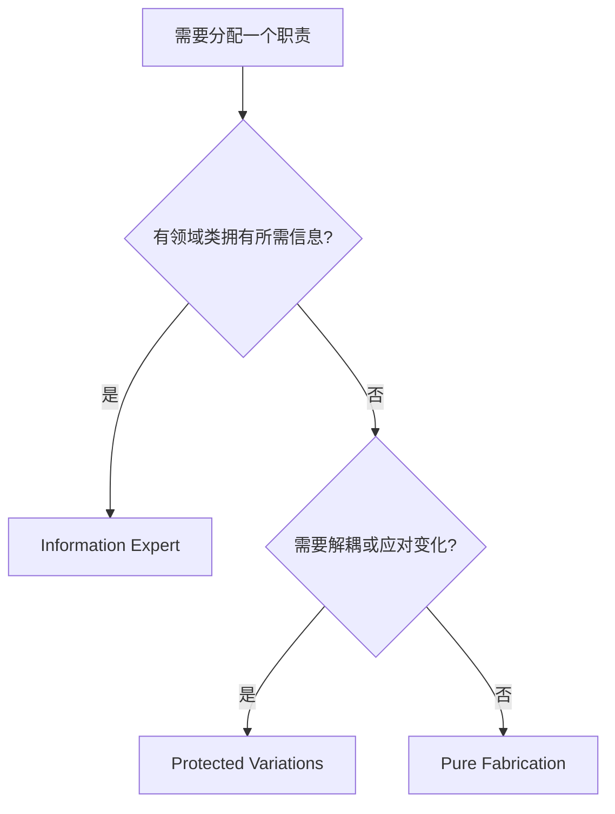

# 07 - GRASP 九大模式（重头戏）

> **建造时间**：Week 3 整周  
> **重要程度**：⭐⭐⭐⭐⭐ **本课最高杠杆** — 案例分析的发动机  
> **依赖**：03 / 05 / 06  
> **被依赖**：13（POS 案例）、刷题阶段全部
>
> ⚠️ **当前用户的最大弱区** — Information Expert 的判断、Controller 的选择、Polymorphism 的应用都需要刻意练习。

---

## 学习目标（Week 3 末必须达到）

- [ ] 能背 9 个模式名 + 英文一句话定义
- [ ] 给一个场景题，能在 30 秒内判断该用哪个模式
- [ ] 能识别 9 个模式之间的关系（Pure Fabrication 何时优先于 Information Expert？）
- [ ] **质量门槛**：是非题级判断准确度 ≥ 80%，否则推迟 Week 4

---

## 9 大模式速查表（Week 3 填充）

| # | 模式 | 一句话定义（英文） | 何时用 | POS 例子 |
|---|------|-------------------|--------|---------|
| 1 | Information Expert | Assign a responsibility to the class that has the information needed to fulfill it. | 默认起点 | Sale.getTotal() |
| 2 | Creator | B creates A if B contains/aggregates/closely-uses A or has the data to initialize it. | 决定 new 的发起者 | Sale creates LineItem |
| 3 | Controller | Assign the responsibility for handling a system event to a class representing the overall system, a use case scenario, or a role. | 接收 UI 层调用 | Register / ProcessSaleHandler |
| 4 | Low Coupling | Assign responsibilities so that coupling remains low. | 评价标准，不是动作 | — |
| 5 | High Cohesion | Assign responsibilities so that cohesion remains high. | 评价标准，不是动作 | — |
| 6 | Polymorphism | When alternatives or behaviors vary by type, assign the responsibility using polymorphic operations. | 类型分支替代 if-else | TaxCalculator (US/CN) |
| 7 | Pure Fabrication | Assign a highly cohesive set of responsibilities to an artificial class that does not represent a domain concept. | 没有合适的领域类 | PersistenceFacade |
| 8 | Indirection | Assign the responsibility to an intermediate object to mediate between other components. | 解耦两端 | Adapter / Mediator |
| 9 | Protected Variations | Identify points of predicted variation and create a stable interface around them. | 应对变化 | Plug-in / Strategy |

---

## 内容（待 Week 3 填充）

### 1. 为什么有 GRASP（vs GoF）

### 2. 9 个模式逐个深讲（含决策流程）

### 3. 模式之间的关系图

### 4. 每个模式的"反例"——什么时候 NOT 用

---

## 决策流程（Week 3 末画一个流程图）

---

## 举一反三

> 把 9 个模式套到一个图书馆借书系统：每个模式各举一例。

---

## 状态

- 完成度：⬜ 未开始
- 关联错题：—
- 下次回顾日期：—
- **质量门槛**：是非题级判断 ≥ 80%
